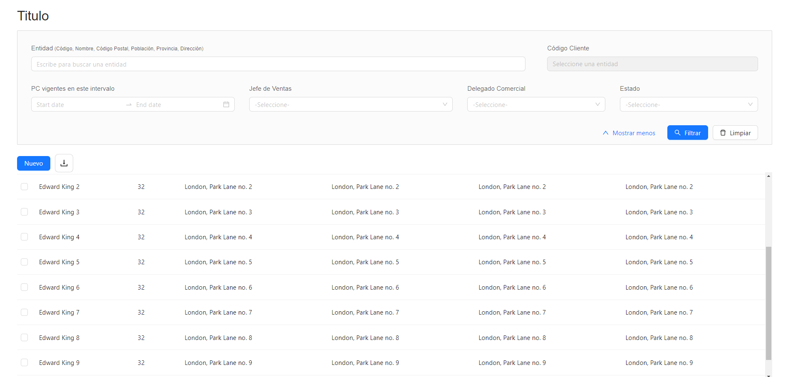

**Estructura de carpetas**

La estructura de carpetas es la siguiente:
- Dos screen o pantallas, una para planes de compra con el nombre "screenPlanesDeCompra" y otra para acuerdos comerciales llamada "screenAcuerdosComerciales".

La screen para planes de compra con el nombre **"screenPlanesDeCompra"** se doivide en components y el documento css y jsx de la pantalla principal "ScreenPlanesDeCompra".
Dentro de la carpeta componentes de planes de compra se encuentran carpetas:
- título
- filtros
- botones nuevo y descarga
- tabla
Cada una de ellas con su documento jsx y su css o sus subcarpetas correspondientes. (Componentes atómicos).

